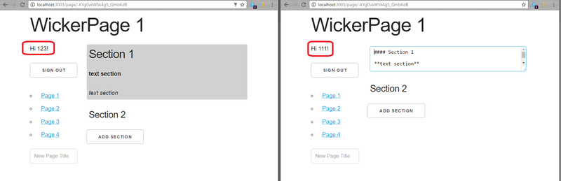

## Intro

Wiki With React and Firebase.

You'll also learn how to use Firebase, a cloud-hosted data back-end for web and mobile applications. In this course, you'll use Firebase to implement a very simple JSON-based data store for the course project: a live collaborative wiki.

Used technologies: 

* React
* Firebase
* ES6
* Node.js
* Express

## Available Scripts

In the project directory, you can run watching:

### `watch "npm run build:js" ./src`

And run the server.

### `node server.js`

Open [http://localhost:3003](http://localhost:3003) to view it in the browser.

Open firebase [console.firebase.google.com](https://console.firebase.google.com).

#### Получить помощь
* [Ваши пожелания и замечания к проекту](https://github.com/it-spectre-ru/react-firebase/pulls)

#### Смотрите также
* [Лицензия](./license.md)

